* 面向 ChatGPT 编程基本流程：

  1.指明代码语言（如 Python、JS）
  2.详细阐述背景信息和目的需求
  3.给出其他辅助信息运行代码、反馈错误，不断改进，直至成功
  注意：很少一蹴而就，往往需要多轮沟通、改进，甚至推翻重来

  

* 真实编程任务案例

  我对 JS 不熟，但最近却在 ChatGPT 帮助下写了一些 JS 脚本，试举一例

  需求：

  写一个能在 Google Sheets 里调用的函数，用于查询某个钱包地址的USD价值总金额

  Zerion 官方文档给出了一段 JS 版本的代码，如何转换成我们需要的格式呢？

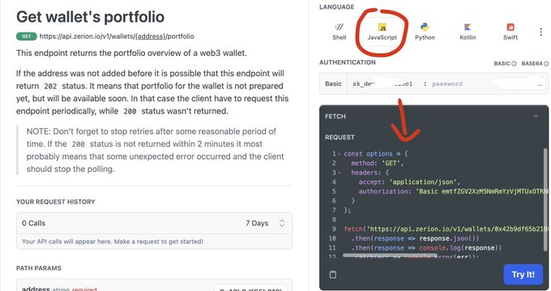

* 提需求

  自然语言编程第一步：向 ChatGPT 提出明确需求

  如：贴出原始代码，告知 GPT 把代码转换为在 Google Sheets 中可运行的代码（其代码和普通JS有细微差异）

  并且要提取钱包地址作为参数，用于函数调用

  ChatGPT 马上就给出了完整代码，但明显不符合需求，我们继续

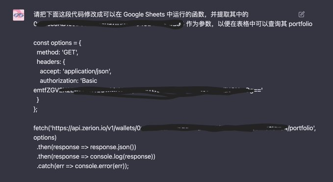

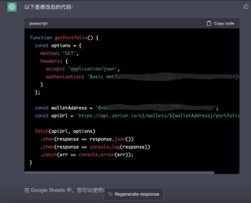

*  改代码

   ChatGPT 忘了提取钱包地址作为参数，我们明确告诉他这点

  很快， ChatGPT 就给出了改好的代码，并附赠了如何在 Google Sheets 中调用此函数的方法

  不过还没完，这才只是第一步。这离我们需要的结果，还有一步之遥，下面继续

  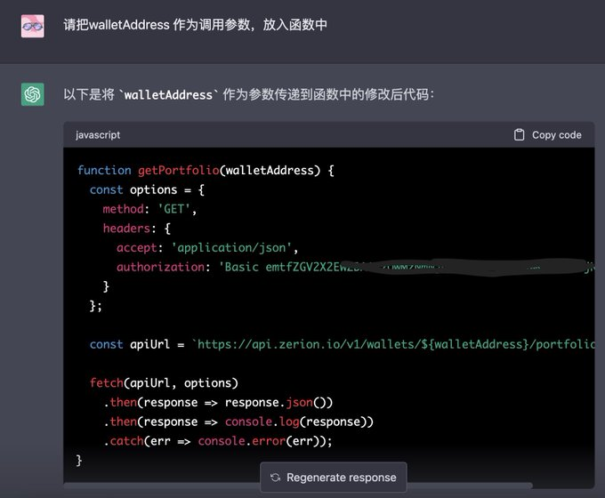

*  细化目标需求

  我们需要提取钱包USD余额，但返回结果是完整的JSON内容，怎么办？

  放大招：贴核心部分的 JSON，让 GPT 提取结果，并修改前面代码

  GPT 马上心领神会，给出了只提取 Wallet 数据的代码

  可惜，运行之后，报错了？别慌，有后招

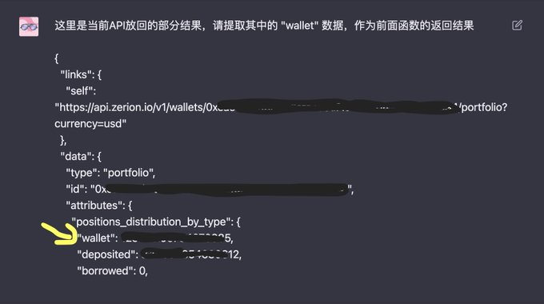

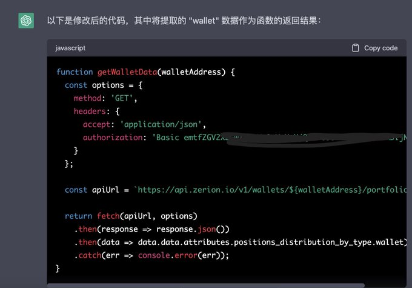

* 有错改错

  几乎没有程序员不写 bug，看来这个定律在 ChatGPT 身上也适用

  好处是，只要你贴出报错提示，ChatGPT 马上知错就改

  提示：这里是因为 ChatGPT 没有使用 Google Apps Script 专有的 fetch 函数导致的问题

  现在核心功能已实现，我们再给 ChatGPT 加点难度

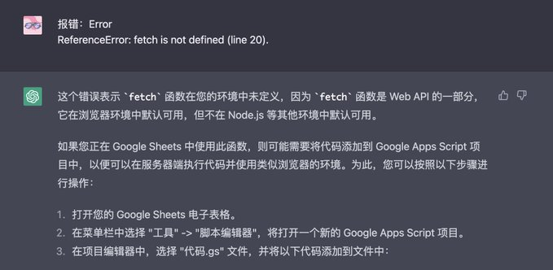

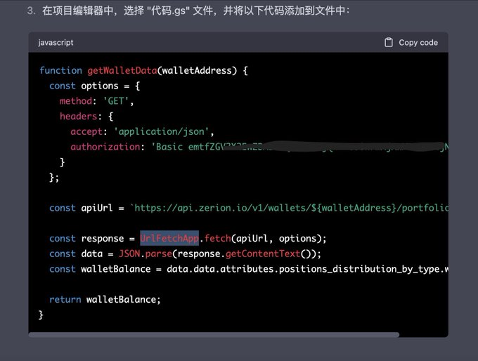

* 增加难度

  经过简单分析， Zerion API 的授权方式是把 API Key 做简单的 Base64 加密

  目标：创建一个根据 API Key 生成授权码的函数，以及添加一个轮询多个 API Key 的功能

  大约经过四个来回，ChatGPT 完整实现了前面的2个需求，把代码整合到前面的代码中，即可得到最终的完整代码

  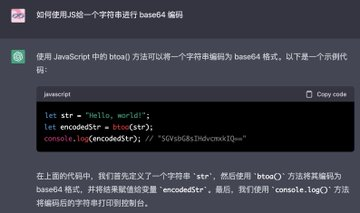

  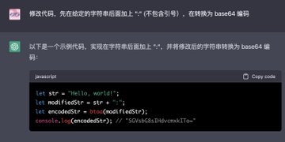

  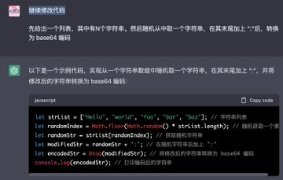

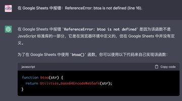

* 总结

  想不到使用自然语言编程的“梦想”在 ChatGPT 身上得以实现，让我们这些小白用户也能体验到编程乐趣

  扎实的代码功底 + 超强的自然语言理解能力 + 超强的上下文会话保持功能 = 循序渐进的面向 ChatGPT 编程体验

  除了 Python、JS等，ChatGPT 甚至在 Solidity 合约方面也能一试身手

  

* 其他提醒

  重要的是把需求描述清楚
  ChatGPT 给的代码可能有 bug，务必多做测试
  可以进行多轮对话，不断明确/改进需求
  可以把 API 返回结果发给GPT，让他帮你提取目标数据

  

