  玩了那么多年的windows，你是否对windows熟悉呢？

### 一、将软件默认安装位置设置为D盘

利用好自己电脑上的存储空间，首先应当合理划分磁盘
我的整体想法是，C盘只用于windows10系统本身，D盘用于软件的安装，剩下的空间都划给E盘用于存储视频，文档等文件

例如有一块512G固态，可以这样划分
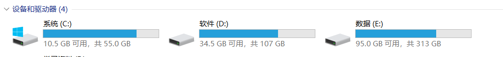
如果那天C盘满了，可以进PE，用dism++进行一次磁盘清理，DriverStoreExplorer 对旧驱动卸载，以及手动清理C:/user/XXX下的文件，基本上操作系统本身的文件稳定在35G左右，这里谈到的两个工具在文章后面有讲，以及如何去下载和使用

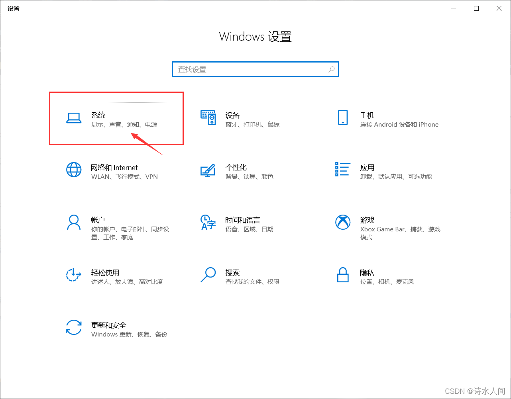
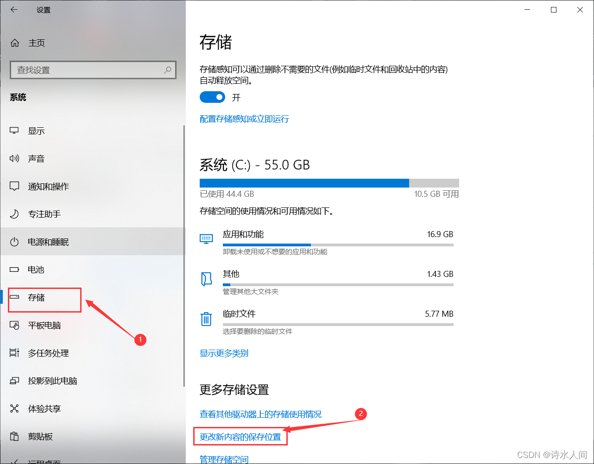
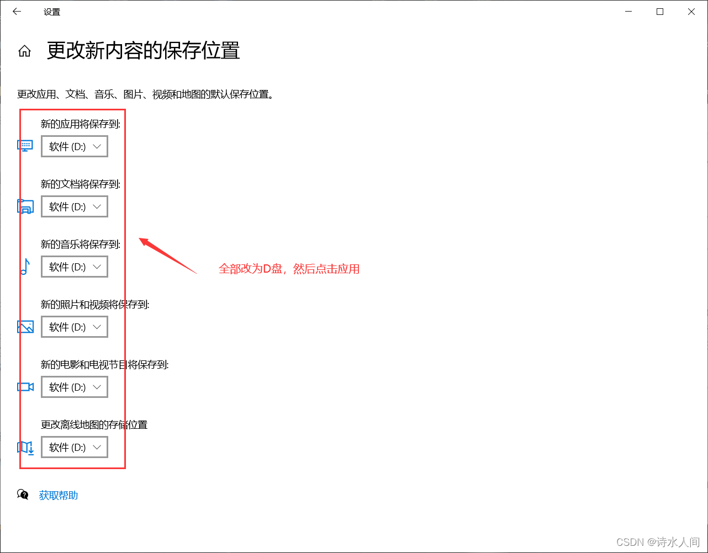
**修改注册表**
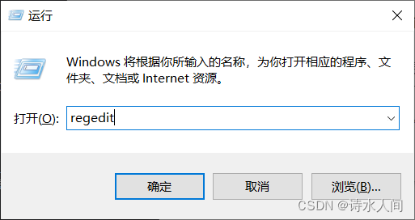
复制下面路径，或者根据下面路径找到对应的项目

```bash
计算机\HKEY_LOCAL_MACHINE\SOFTWARE\Microsoft\Windows\CurrentVersion
1
```

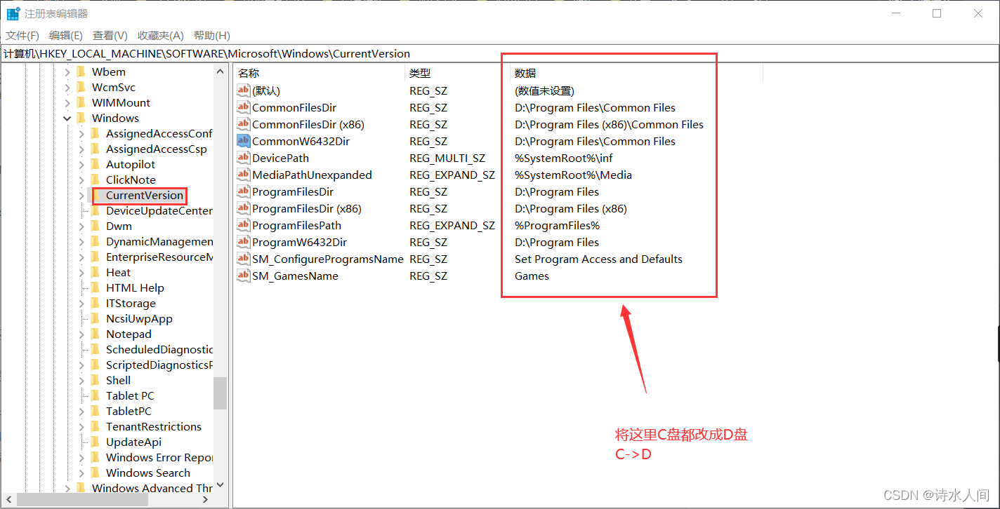
这样新安装的软件都会到D盘

  对于C盘中的文件你是如何清理的呢？

  你能够和我一样安装了那么多程序后还能将系统控制在40G以内？
实际上40G以内不是win10的极速空间，而之所以会是40G以内的原因是系统启动后会占用7G左右的空间，所以实际上win10是可以控制在30G以内的。并且不卸载任何系统应用程序，保留了win10的完整性。

##### 将系统盘控制在40G以内，看下成品，我能够将系统控制在55G内。

磁盘空间分布截图
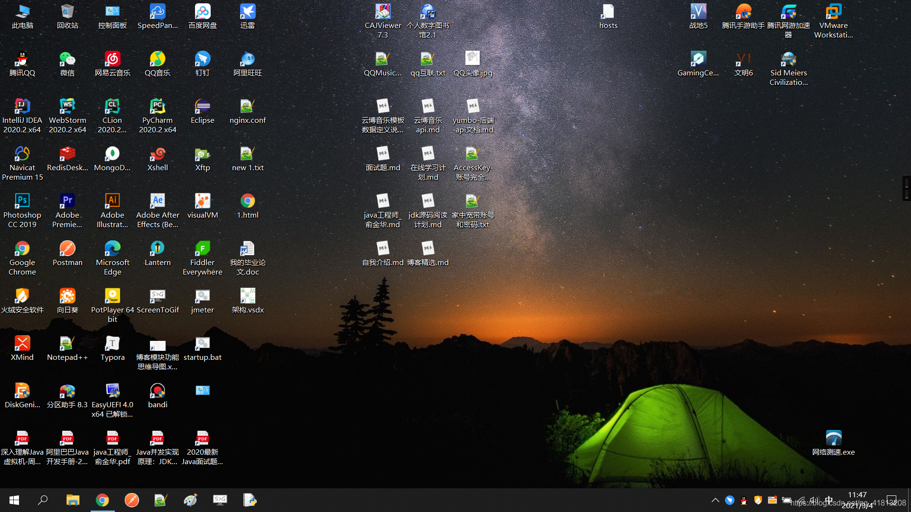
安装过的应用程序

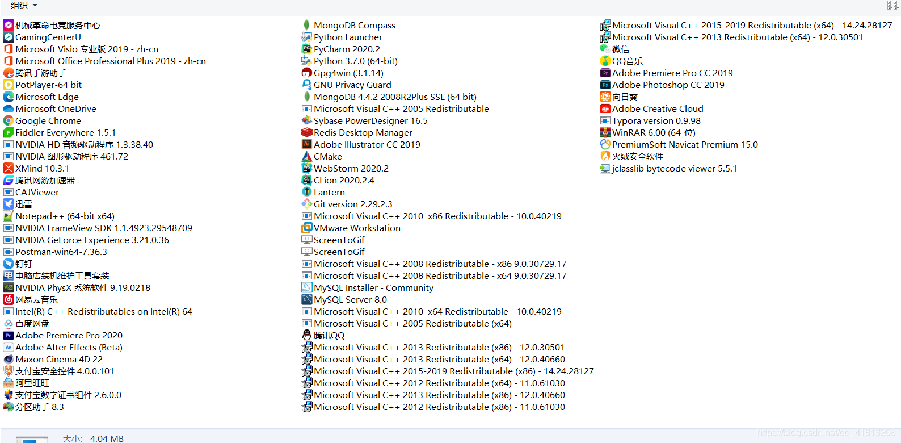

------


------

#####   没有足够的知识面，你如何学好一门知识？没有足够的知识面，你如何知道你学的知识的重要性？没有足够的知识面，你如何灵活运用你的知识？

  随着不断对linux的熟悉，对于操作系统的理解也越来越全面，加上对于硬件的关注，对于整个计算机有了一定的全面了解，也正因为我对这些内容的掌握足够全面，以至于我后来学习变得很轻松。

  对于java程序员，其实我是建议知识面多多的往运维方向靠拢，因为运维更接近底层，对于学习新技术新知识都有一定的帮助，其次前端也要有一定深度，这样你才能对基于C/S架构的系统中有一个更全面的理解。

  如果你对 linux 非常熟悉，然后你再来玩windows，对于windows的掌握就会更深入。

  在linux中你会经常用到服务、环境变量、内存管理、进程管理、网络端口等。然而在windows中也有一套，只不过大都是图像界面化后的，一般很少有人会用到，所以一般人遇到问题基本上就是重启大法。

### 回归正题，教你清理C盘空间，如何让C盘不会越来越大。

  在我们使用windows过程中，经常会遇到windows更新这种问题。更新往往会下载很多包，更新后，哪些包还不会被删除，会一直留在哪里，这些文件还比较大非常占空间。

### 一、先清理C盘不需要的文件夹

##### 下面是我电脑上C盘的文件夹和文件，其它文件夹或文件可以删除掉（`谨慎删除，一般情况下都可以删除，如果是驱动，则进行卸载并安装到D盘`），直接删除如果权限不够，就下载[火绒](https://www.huorong.cn/)，通过火绒的文件粉碎进行粉碎（`火绒也粉碎不了的就让它保留，或者pe情况下进行删除`）。

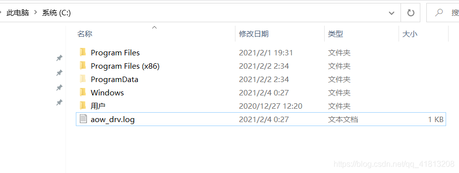

##### 火绒文件粉碎功能

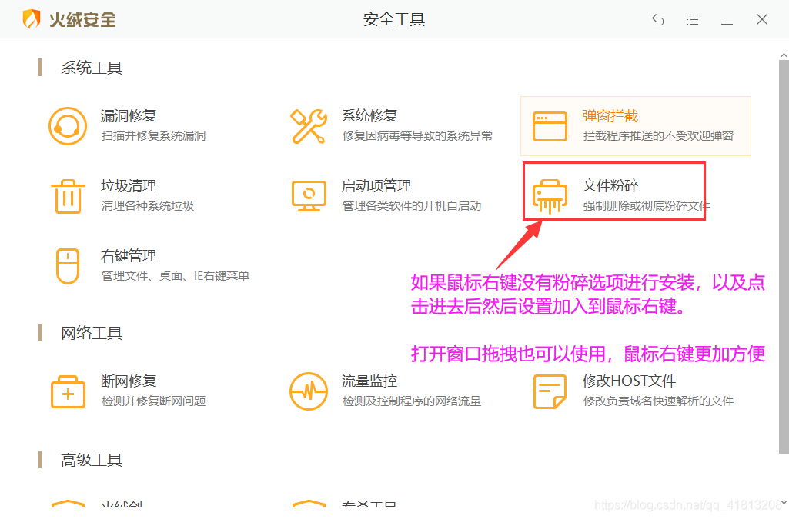

------

### 二、其它方式的清理

####   第一招清理休眠文件（清理几个G左右）

  系统休眠时会将将文件保存起来，当你从休眠状态唤醒时这些文件并不会被自动清除，通过下面命令进行清理即可

```bash
powercfg -h off
1
```

####   第二招、清除重复的驱动

  如果你经常翻看C盘文件，你会发现这个路径 `C:\Windows\System32\DriverStore\FileRepository` 内的文件占用空间特别大，就是一些驱动的缓存，我们可以将其清理掉一些，来节省空间。

  去下面这个地址下载一个软件
  https://github.com/lostindark/DriverStoreExplorer
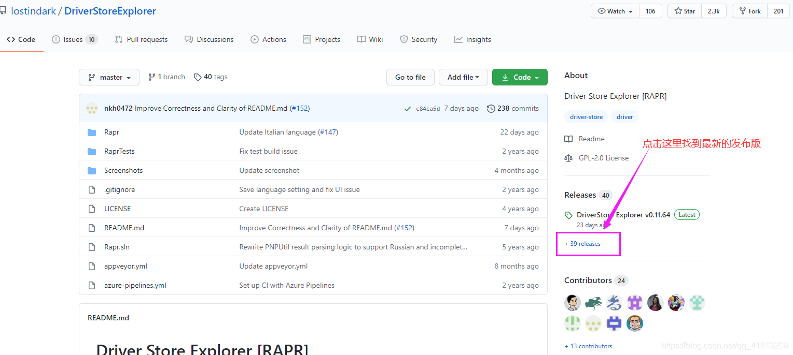
下载后将其解压

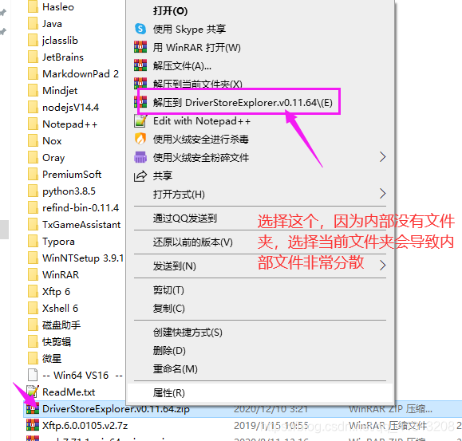
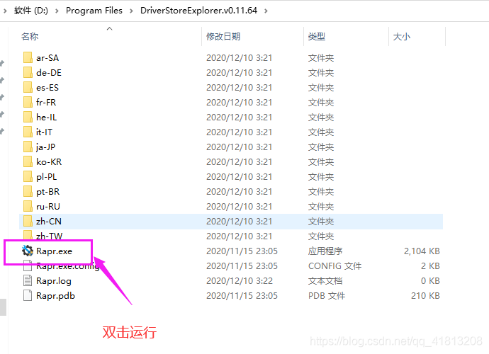
如果设备名称是灰色的则说明是没有正在使用的设备，也是可以删除的
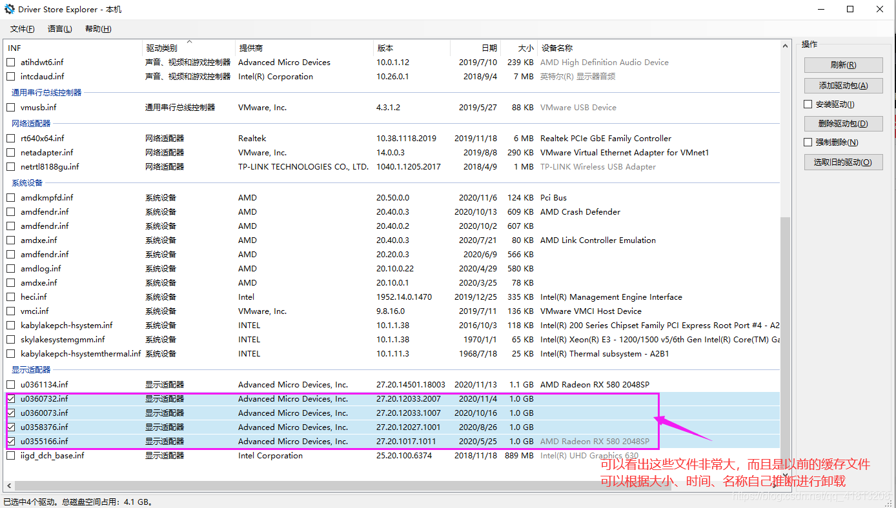

一般这一步应该能清除好几个G的空间，看你以前到底积累装过多少驱动了。

####   第三招更改虚拟内存

默认的虚拟内存是用在C盘中的，将位置更改为其它盘，我的物理内存是16G，所以默认系统的虚拟内存是1G，所以这样就相当于C盘可以多出1G空间

下面是新版本win10的高级系统设置位置：此电脑=》属性。
或者，设置=》系统
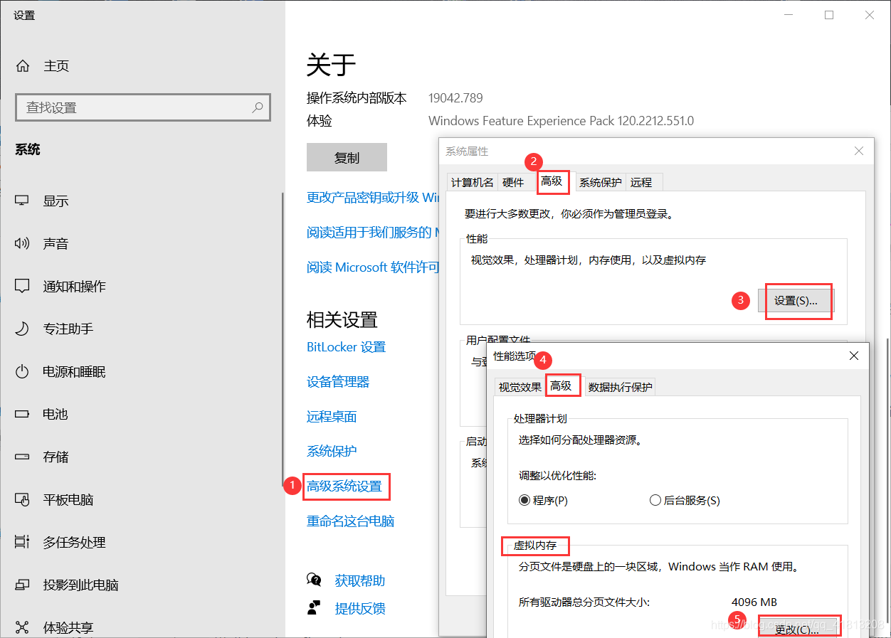
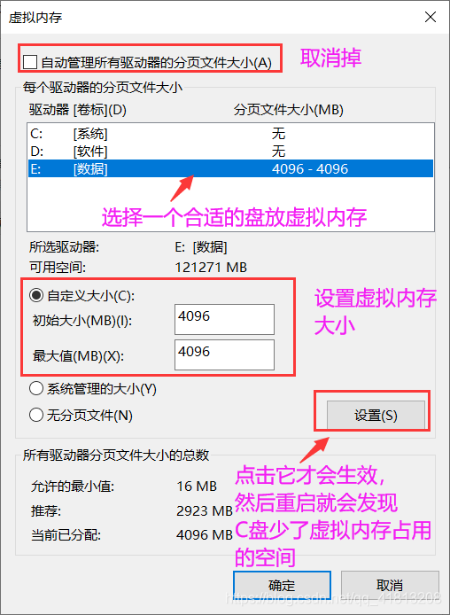

####   第四招、利用Dism++进行清理一些文件

  [Dism++官网](https://www.chuyu.me/zh-Hans/)
  [github下载地址](https://github.com/Chuyu-Team/Dism-Multi-language/releases) 找到最新版进行下载即可
  [CSDN下载](https://download.csdn.net/download/qq_41813208/15559715)
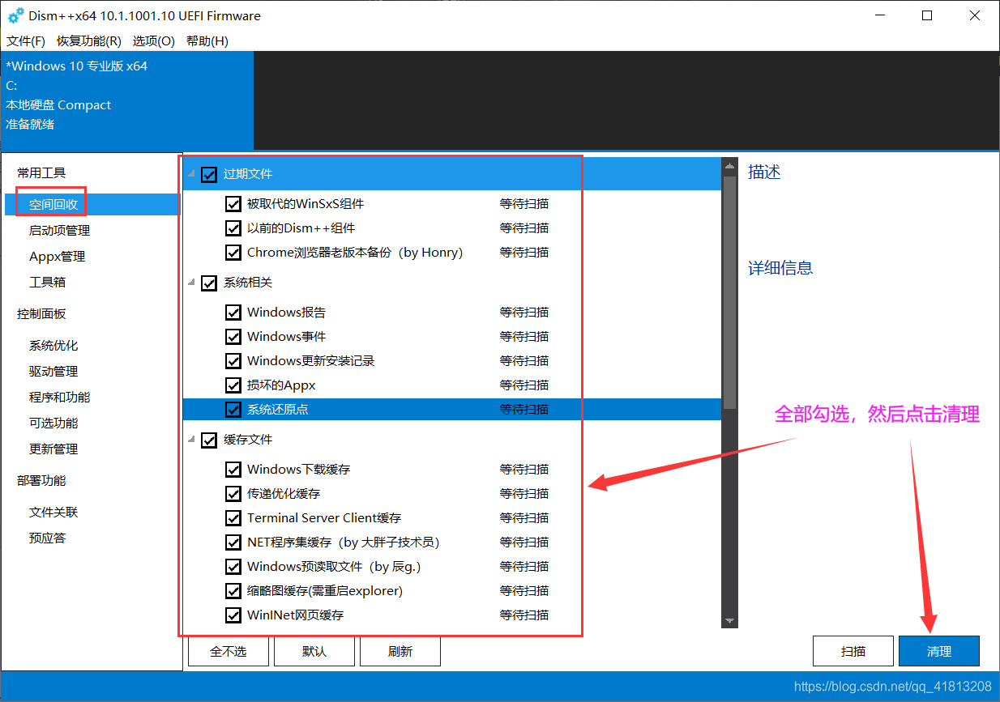
大概又可以清理出几个G的空间。Dism++不只有清理功能，还有系统备份成wim，以及优化一些win10的设置，分别在菜单栏中的系统优化等功能，可以自行探索。

####   [第五招、永久关闭windows更新，Dism++中也有这个功能](https://blog.csdn.net/qq_41813208/article/details/103249014)

  点击上面的链接查看我之前写过的一个关闭windows永久更新的博客
  要想让C盘不增除非不往C盘里塞文件，否则永远无法根除C盘空间不够用的情况。因此后面几招都是控制往C盘塞文件的操作。

####   第六招、控制软件的安装位置

  一般安装软件都可以自定义安装路径(`要想让C盘不会遇到不够用的情况，那么很明显不往C盘塞文件，因此建议一定要自定义安装路径`)，只需要在安装的过程中选择一个合适的路径就可以了
  我安装软件的一般做法就是直接将C盘改成D盘，D盘专门放软件或者代码（代码一般都不会很大）。其它就让它默认`Program Files / Program Files (x86)`，建议软件还是放在这两个文件夹下，方便管理。

  而我之所以这么做的原因是，我会将系统备份，防止系统崩溃，即使那天系统因为装了什么软件或者中木马了，我可以通过备份文件将系统还原一下即可，而还原系统是需要格式化C盘的（`不格式化就会导致保留旧系统文件，这样非常占空间`）然后进行还原即可。这样我付出的代价非常小。因为在那个时刻我桌面的快捷方式，一些平时的使用习惯都保存了下来，而我`格式化C盘很多软件并没有影响，因为我装在了D盘(备份的时候这些软件也就不需要备份)`，备份系统实际上就是备份C盘的文件。

####   第七招、更改环境变量

  此电脑 =》鼠标右键 =》 属性 =》高级系统设置 =》 环境变量
将环境变量 `TEMP、TMP`路径从C盘中改到另一个盘里

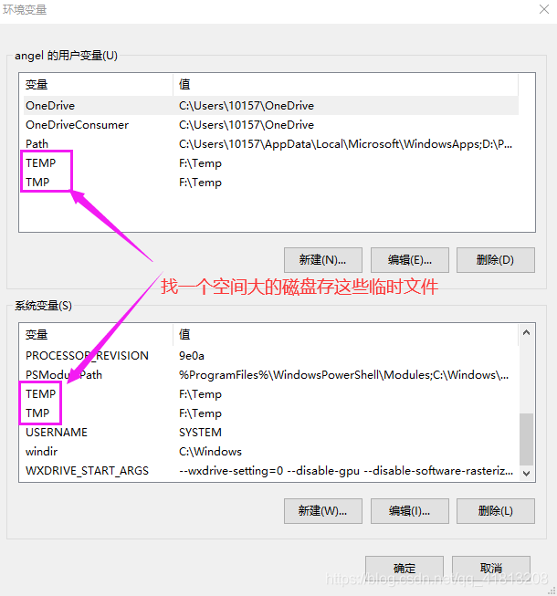

##### 相关文章推荐：

[备份还原win10](https://blog.csdn.net/qq_41813208/article/details/113657365)
