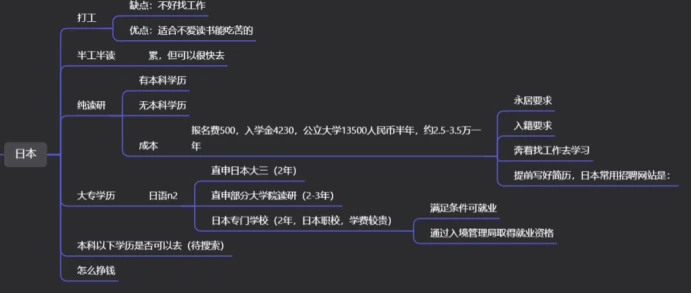

**到底是什么阻止了你润？（手把手穷蛆跑路教学）**

 声明：本篇文章主观色彩浓厚，基本都是个人经验，重点在于**说服我自己**，且本文不是方法合集，只是一个整体规划，已经有出国想法的低学历穷蛆可以看看，想留在国内的我尊重你的生活方式，但阅读本文的默认你有出国想法。

 一说到出国，大部分穷蛆脑海里立马就会蹦出几个词汇来：

**与我无关/天马行空/高级/有钱/蝙蝠人死妈了/外语超级好**

为什么你自动把自己和“润”这个字割裂开来？

1.我有思维惰性，只会单方面接收信息，百度只会用来搜LOL出装，谷歌只会搜辱华，小红书只看骚脚打飞机，害怕生活发生变化，  懒狗一条

2.我太穷太懦弱没毅力，什么都做不了

Run可能是最考验信息、认知、决策、行动全过程的理性与效率的人生项目，是对第一次无法自主选择的投胎和之后身不由己的生活轨迹进行积极的、主动的修正和干预。
Run是自己争取改变命运，本质是人竞天择主动寻求进化，强者和适者进阶，弱者和不适者被淘汰。

 

这两点决定了你虽然和其他人**（身无分文却脱支成功的穷蛆）**条件差不多，但是你只能看着别人羡慕。我很讨厌天马行空这个词语，因为生活中所有人所说的天马行空都是扯淡，他们只是害怕接触自己未知的事物。所谓天马行空，绝大部分来自于对未知事物的恐惧与担心。举个例子，普通人总觉得出国很遥远，需要很多钱，需要很多所谓“专业的信息”，但所谓专业的信息，不仅可以买到，更可以免费得到，后面会说方法。

从小到大，父母老师一直在告诉你一个东西：你不能做这个，你要脚踏实地，你毕业了可以谈恋爱了；你26了，可以结婚了；你28了可以生小孩了；什么时间，你得做什么事，因为上一代人的幸福定义还停留在超越农耕文明。家里有能力的可以给你一个一眼望到头生活的规划，家里帮不上帮的就只能干瞪眼。我们的教育目标不是让你成才，是通过筛选，规划整个社会从头到脚的每个螺丝钉。并且大部分人的教育水平根本不够跨越家庭条件的鸿沟，985毕业生没有家庭帮忙/选错专业，混得很好的也是寥寥无几。既然如此，何不换一个赛道？幸福感是比较出来的，如果你在国内自认是底层，虽然都是打工，但大概率在国外会比这里幸福得多，毕竟不是住鸽子笼，骑电瓶车，还不用出个什么事情就被关在家里或者发个什么评论提心吊胆的。可是前提是你得想清楚一个问题：

**什么才叫天马行空？什么叫做脚踏实地？**

 

傻小子成为世界首富，低智商考清华这叫天马行空。因为要成为世界首富不仅要超高智力还要运气和情商等等，考清华也需要智力。大部分鼠人都是普通智商，和我一样的大专三本，而一个基本不需要靠脑子的，只需要毅力，而且有一大批比我们学历更低的穷蛆集美曾经坚持下来做到的事，远远算不上天马行空，没有比不需要动脑子也不需要多少钱的事更脚踏实地的事了。你会发现，很多专科去德国上班了，很多快专科毕业的集美通过打工挣到学费，读了硕士拿到了澳洲的绿卡。他们为什么可以做到你做不到，他们真的比你聪明吗？他们只是比你有决心，有所谓的“方法”和“路子”。

 

任何事情或商业想法，如果只说不做，你的想法再棒，也只是毫无用处的空想；即使你的计划有漏洞，但是你只要踏出了第一步，遇到困难解决苦难，再远的目标，只要其他穷蛆做到过，那你一定能够做到，可能慢一些，可能曲折一些，但是只要他做到了，你就行。**在大目标面前，人会心生退意，但理清过程，细化目标后，“穷蛆”和“跑路”这两个曾经认为八竿子打不着的词语中间就会出现像藕丝一般的线，你越细化，线就会越粗，直到这两个词语紧紧的绑在一起。**

 

**跑路之路从何开始？**

首先，列一个思维导图，推荐幕布，因为免费。导图左边一个穷蛆的框，右边是海外跑路，连起来，中间慢慢的加路径。

这个图里的信息不准确，我瞎写的，总之理解一下意思就行了

你每往这两个中间加一条信息，那么这个看似天马行空的事，在你每列出一个流程之后，就变得脚踏实地了起来。举个例子，第一件事，存钱。你加入这个思维导图中间，接下来你得列：如何省钱？分支列出几种方法与计划，工资到手5000，我租房800吃饭1200，还剩3000，除去出去玩等一系列开支，预备存2000。假设我要存10万，算死工资，10万/2000*12=4.16年，你可以存出一个去日本读本科的钱，可能会拮据，但也能够出发。身无分文怎么办？存呗。有稳定工作最好，没稳定工作，送外卖干啥都可以，骑驴找马，总可以找到一份薪资不用很高但工资稳定的工作。另外开一张银行卡，每个月打规划好的，固定数额的钱进去，如果你每个月都要给家里打钱供奉爹妈，那我劝你早点和家里说清楚，不然这个帖子也不用看了。如果每个月你是随缘省，你会发现一毛钱都省不下来，推荐一本极简理财指南，可以简单的指导一下还债和省钱，投资那块可以不用看，zlibrary有。

在国内，尽量不违法的前提下得想尽一切办法搞钱，不然没法起步。（当然也有挣到机票钱就能去的方法）

**家庭安排**

 

其次，家里的事需要安排好，和父母好好沟通，如果父母是讲理的人，讲清楚就没问题，如果不讲理，那就去过自己的生活吧，问他们买保险没有，如果没有就看看是否符合条件，**买好重大医疗险**，因为中国不像其他国家，任何变故都会把你拖在这里永世不得翻身，特别是穷蛆的家庭大概率伴随着疾病，防患于未然就更加重要。

陪伴父母这件事没啥好说的了，你非要在父母身边现场陪伴，那我没话说，尊重你的选择，你现在就可以不用看了。但我一直觉得亲子关系要说爱不要说孝，因为爱是相互的，而孝要求顺从。如果他真的爱你，他会允许你去追求更好的生活。二三十岁的人天天说陪父母，五六十岁了天天让子女在身边，除了一家子巨婴想不出第二个词。正常的家庭应该是你混得好，父母就会高兴了，再说你父母真的需要每天在身边陪伴吗？真的是为了孝顺爸妈不是为自己懦弱找借口吗，其次父母以外的亲戚关系真的必要吗？如果你有兄弟，他们也会希望你过得更好。

所谓的出国，从上海到日本，2个小时，从沙东到韩国更快，比你一个河南从深圳回老家更快，所谓的出国，不过是心理上的距离变远了。如果你在国内找到一份好工作，一年放30天带薪年假（德国法定最低，一般是40左右），不够你回国陪你爹妈的啊？过年见面，你发小惊讶的发现你的年假时间比他们一年的法定假加起来还多，更别说你还有其他的法定假期和周末周日，不比你在北上广打工回家的时间多？8小时工作下班还有时间联系父母打视频，更好的自己是送给父母的礼物。

父母如果不太同意，先说出国打工，慢慢磨。人际关系自己处理，我就不说太多了，因为这也主要也是对我自己的说服，我自己早就消化这部分了。

 

上面的都可以放入一个大类：出国之前的打算，接着你在那几个分类种，细化出具体需要做的事。出国之后你要做什么？

\1. 直接工作

\2. 读书

 

读书，在你工作后去读书，你应该明白，所有的东西都是为了你以后跑路，而获得跑路资格，你就得有一份在国外的他们在四五年内还会热门紧缺的工作类型。在你读书之前，就需要了解对应国家的工作，你是为了工作去读书的，你在选专业的时候甚至可以先去那个国家最热门的招聘网站看工作，按照你想做的/工资高的工作要求的对口专业去申请要读的专业。

不断地提出问题：他们在哪里招聘？他们的简历要有哪些内容？要写性别和年龄吗？他们通常在哪个网站投递简历/招聘？他们的这个行业巨头是什么，基本工资是多少？我去读什么专业最好就业？雇主是否能够提供合格的工作签证让你拿到永居？**每提出一个问题，你会发现有更多的问题等着你，因此你的思维导图树枝就会一直分叉，整个导图会越来越大。**

 

 

**最重要的部分，如何收集信息？（方法和路子哪里来？）**

万事开头难，很多人对于第一步该干什么感到茫然，首先，时间和金钱，你总得付出一种，因为信息不会主动跑到你面前来。我推荐你先收集信息的同时学语言。

不得不承认，小红书绝对是润学最有用的软件——因为这个软件**设计出来的初衷就是为了给海外的华人使用，后来才开放给国内用户**，这也是为什么经常能看到海外ip的原因，这是国人能接触到的海外华人最多的平台了。我本人在上面就加了好几个好友，说实话这些在海外的华人，动态里喜欢分享生活的人，绝大部分都是比较乐意免费解决你的疑问，你只要礼貌，客气，一句一个谢谢，正常人都会把他们知道的东西告诉你，毕竟你们之间没有利益冲突。

 

例如你想去澳洲，你如果经常搜索，首页推荐就会弹出来一些文章，分享澳洲生活的之类的，去底下评论随便找，ip地址在澳洲的，加好友“您好，我想了解一下关于在澳洲工作/读书方面的东西，请您指导一下”，加一个表情，只要你头像不是恶臭男，海外的集美都是愿意帮忙的。上面的海外华人多到超乎你想象，可以尽情添加好友，一个不通过，还有几十个，按我个人经验，加了4个人全都通过，而且都非常热心给我解决问题——包括真实的工作情况；机票怎么买省钱；如何在那边留下来；应该去什么当地网站搜索我需要的信息；在哪里找工作；怎么样找工作有优势等等等，省了很多找中介问情况的钱。

那为什么要找他们，不去找专业中介/律师呢？

第1， 平台很大，做什么的都有，在国外上学的，工作的，偷渡的，旅游签黑过去的，只要你搜索的当，都有，我全都看见过。

第2， 而且因为他们是过来人，而且这些人基本都自己曾整理过信息，diy跑路之类的，没整理过也花钱问过别人，要知道这些可都是律师和中介这些拥有信息差的人收钱干的事。

第3， 大部分鼠人是穷懒蛆，不愿意去国家官网搜集信息，又不想花钱请几万块的律师和中介帮你全部整理好，那么低声下气，一口一个“打扰了谢谢老哥/姐妹，真的非常感谢”地求小红书网友给你解疑绝对是你的第一选择。

 

**举个例子** 比如我想通过whv签证去澳洲打工，攒出自己的留学生学费（专升硕），我就去搜索whv签证，可以得到很多结果，我随便点开第一条进去看看。

从这5张图评论你能够得出哪些信息？

第1页信息：澳洲劳动力短缺且有whv签证者证实真实性

第2页信息：河北农村一分钱没有的农村穷蛆集美，通过在澳洲打工挣出学费现在在等绿卡。

第3页信息：没有钱，纯靠打工可以挣出所有学费。你在中国是不可能挣出澳洲学费来的。

第4页信息：雅思要求只有4.5，满分是9分，4.5我个人认为相当于高中偏下水平，属于不需要一点天赋和智力，不认识字母表一年就能达到的水平。

第5页信息：有很多人知道在那边打工什么事情工资高。

 

得到了这这么多信息，**添加到自己的思维导图上后**，现在开始就要开始加人，首先把你的小红书弄好头像，可爱的，然后性别呢，你如果能装女生，就设置女，不会装就别弄巧成拙了。接下来，你点开头像私聊，比如第五张图，你想了解什么工作工资高，你就要加“纯情炸串”艾特的那个人，因为据她说这个人在那边打工工资很高。又比如你是农村穷蛆，那么你就加那个河北农村女生，她的条件可能还没你好。不要加个一个两个就停，免费软件，加人不用钱，这可比给中介钱划算多了，**加100个人，通过10个，你能得到在中介那里花5000才能得到的信息。**然后再把新得到的信息再加到思维导图里面，为啥我老说思维导图，因为我总结能力不强，如果是一篇竖着写的文章或者笔记，我看不到整个脉络，思维导图能够看清各个时间段该做什么。（题外话：穷蛆集美的行动能力真的行，这些打工跑路挣出自己专升硕学费的基本都是女生，废物们天天就知道羡慕，天天就“我没路子啊，我没办法啊，我不知道啊”三连，你是没长嘴还是不会打字？找没水印的黄片的时候好像那个夏洛克·福尔摩斯，全网地毯式搜索，这时候你又不会用百度了？操你妈的，特别是有些条件比他们农村的好多了左一个借口，右一个借口的，要不是鼠人我真的懒得说！）

 

上面我举的例子是澳洲，如果你想去日本美国加拿大，都要先搜集信息，列出一个各个条件并列的思维导图，给出想去的理由，找出一条最适合自己的路（工作挣钱读研/有钱直接读研/直接工作）偷渡和直接工作不推荐，有个国外的文凭，不一定非得名校，起码在当地就业还是挺好的（年纪不重要，我都25了...)。然后根据自己实际情况选出一条最可行的标红，顺着画下去，画到需要的材料（如办什么证，考什么证需要的步骤）的时候，把材料也一样一样列出来，最后一条一条的去打勾，从存钱学语言搜集信息开始，不管是厂里打工还是公司上班，想存钱就得省，克制一下自己买东西的欲望。

 

PS:以上所有关于澳洲whv的信息均为随手搜索，并不一定是个好方法，只是举个例子，可能其他国家更轻松也可能更好也不一定。

 

**信息搜索优先等级：小红书私聊加好友问＞小红书搜索文章＞各个国家跑路/打工政策的政府官网＞中介＞知乎百度等国内搜索引擎（不建议百度）**

搜索不到我要的信息怎么办？**你的第一目标应该是加人私聊问**，因为肯定会有很多模棱两可的信息，不能确认准确性的信息，你得向当地人确认。鼠人们，记住我一句话：为了自己的前途在网上求人，一点都不丢人。

 

另外，去相同地区，且相同路子（如都打算打工挣学费）的鼠人们可以发帖，拉群的话只建议建立禁言群，在自己的思维导图做好后让群主代发发到群里供参考和提建议。这是一件需要毅力的事，可能是2年3年5年10年，没有同伴的长期支持可能很难坚持下来。

**专业不好怎么办？**

\1. 转码，有些国家应该是可以跨专业申请研究生，或者直接读个本科

\2. 先去招聘网站看工资高的工作，带着目的去选专业

\3. 不想读书了，可以做低技术工种，去国外炒中餐，农场做黑奴，加油站打工等（这我就不知道能不能留了，自行搜索）

 

这时候要说到所谓的“沉没成本”：

沉没成本，是指以往发生的，但与当前决策无关的费用。从决策的角度看，以往发生的费用只是造成当前状态的某个因素，当前决策所要考虑的是未来可能发生的费用及所带来的收益，而不考虑以往发生的费用。比如你学了个土木，觉得”我换个专业的话那4年不是白读了?”那就好像“和对象谈恋爱几年以后，发现他（她）并不适合结婚，但恋爱期间投入了大量的时间精力和金钱，这些是无法收回的，这是一种沉没成本，不愿意抛弃沉没成本，最后只会选择大家将就一起过，结婚之后日子过的鸡飞狗跳。”买基金的狗友就会发现，这个基金怎么他妈的一直在跌，我投入这么多舍不得抛啊，结果一直跌一直跌，永远涨不回来了，我的建议是及时止损。

 

**英语/日语不好怎么办？**

学呗，语言这东西你只要会中文，就能学好其他语言，为数不多不需要脑子就能学好的课程。学语言的决心都没有的话，尤其是雅思4.5这种不认识字母表一年都能学到的程度都不能坚持的话，那我只能说你现在如果过得不好确实是活该。

**学历中专/大专/初中/小学怎么办**

都一样的方法去搜集信息，其他的中专高中生能走你不行？看看他们是不是在国内提升了学历再走，还是说直接出国打工，不过你肯定要比学历高的跑起来复杂一些。

我底层蛆但是不想跑怎么办：那就尽量往体制内挤呗...这都不用我说，不过绝大部分人挤不进就是了，只能看着和他条件差不多的鼠人run了，一阵伤感从心底涌起，然后心里想：**“不是我不想跑，不是我懦弱，我有你们所有鼠人都没有的难处（没护照、单亲家庭、每学历、没钱、没offer，没这没那），你们比我容易多了！”**（大家都是臭老鼠，家家都有本难念的经，**农村穷蛆单亲集美**都拿到澳洲绿卡，就你他妈尤其困难些）而且护照，签证，所有这些东西都是存在大量现成信息（没护照、学历低等一众借口）的，只要肯搜索肯舔网友，99%都能找到在合法范围内实现目标的方法。

 

润的路上有无数种排列组合，你很难立马找到最适合你的路。 如何找到最适合自己的路呢？不要加入一个群，马上就问怎么润。 正确的姿势是：通过在网上搜索各种案例、和熟人讨论、和移民中介讨论，收集大量的信息，熟悉每种路径的成本和具体方案，然后根据自己的实际情况选择最佳的路径。 而更为准确的方法，就是在你有了一些基础知识后，寻找一些和自己背景相似、而且已经润成功的案例，然后复制粘贴即可。最后我想说，这些事情真不是哪些需要天赋才能做到的事，唯一需要的是规划和毅力，规划可以让别人指导你，没毅力那你就是活该了。不迈出第一步，那么永远只是嘴上说说羡慕别人，如果你迈出了第一步，你会发现，即便中途会有困难，但是总有知道解决这个问题的人可以请教，车到山前必有路；每当想放弃的时候，来浪新里发帖求鼓励安慰，再想想你当初是怎么做出这个决定的。**迈出第一步，永远是最最最最最重要的事！**

 

**你的一生都在妥协，从来没有真正选择过自己的生活，人生短短几十年，你愿不愿意为自己活一次？！！**

