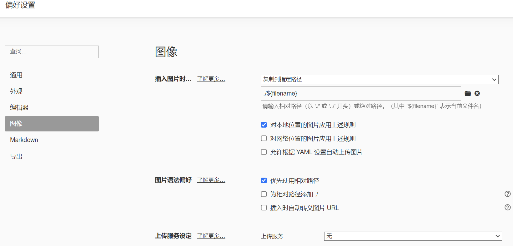

比较好用的解决方法，能够同时在 Hexo 博客和 Markdown 编辑器中正确显示图片。

首先，根据 Hexo 官方文档，在 `_config.yaml` 将 `post_asset_folder` 选项设为 `true` 。然后，安装插件 `hexo-image-link`，安装命令为：

```
$ npm install hexo-image-link --save

BASH
```

如果安装了 `hexo-asset-img` 插件，需要将其卸载：

```
$ npm uninstall --save hexo-asset-img

BASH
```

然后，配置 Markdown 编辑器 Typora 如下：



配置完成后，在 Typora 中粘贴图片时，Typora 就会自动将图片保存到与文件名同名的目录下，并在 Markdown 中使用相对路径引用图片。这样，我们就可以在 Hexo 博客和 Typora 中同时看到图片。
