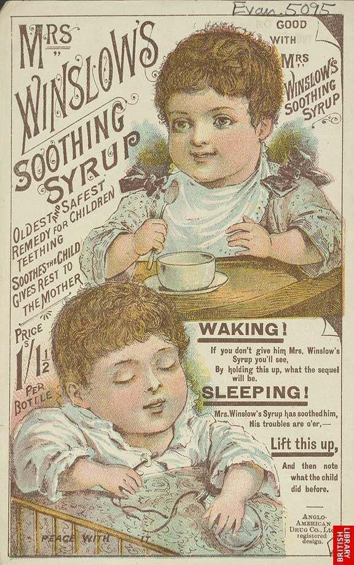
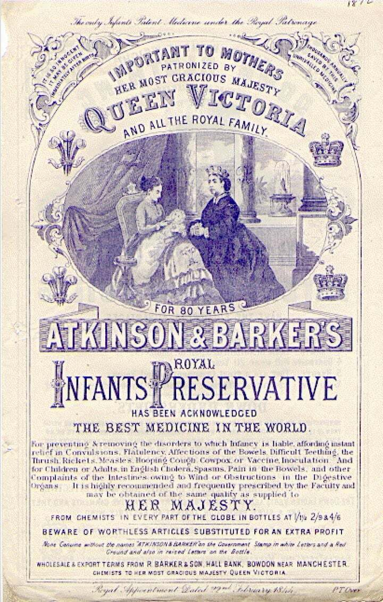
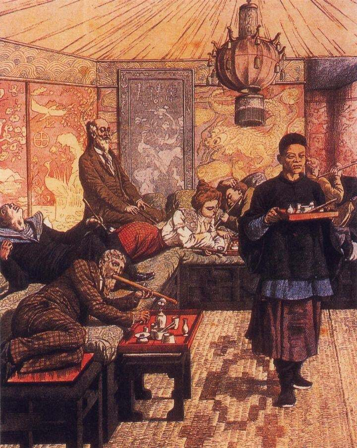
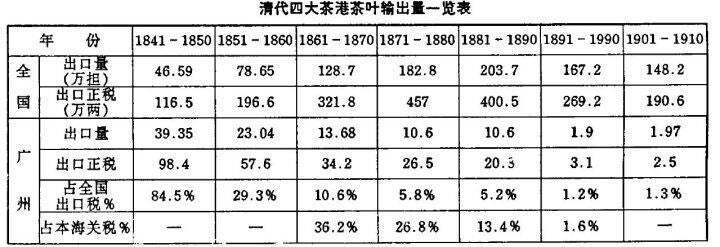
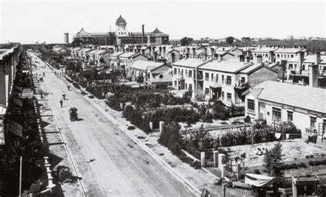
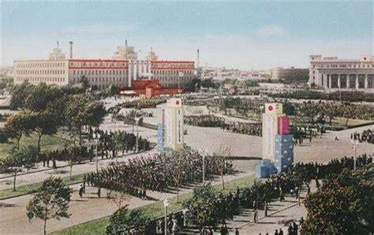

在我匪的炒作里，从鸦片战争到抗日战争中国都是不断被列强疯狂欺凌的。而终结这百年屈辱史的我匪则是建立新中国让中国重新独立自主的伟大存在。而这种民族主义才正是如今我匪执政的合法性所在，而非所谓的共产主义。

其实所谓民族主义就是要大家都觉得自己的民族是无辜的而其他民族都是坏人。只有这样才能利用人类朴素的正义感和排外感来让大家团结一致仇恨外国。

无论是纳粹宣扬的犹太人吸血德国论，还是日帝的驱逐英美侵略者实现大东亚共荣论，其本质都是通过宣扬本民族被外族压迫来让民族主义深入人心。

然而真实的历史却和我匪描述的历史大相径庭。西方对待中国的态度实际上更接近于西方国家对待西方国家的态度而非对待殖民地的态度，清朝战败后的赔款也远低于同时期战败的西方国家的赔款。

而西方对待清朝也要远比清朝对待自己的附属国和本国居民更好。 比如英国将领戈登因李鸿章背信弃义屠杀太平军战俘而打算找李鸿章决斗，这件事我会放在最后讲。其实清朝时期这种西方人还挺多的。比如帮清朝省下巨额对法赔款，还让清朝关税收入暴增的精神清朝人罗伯特·赫德。

我接下来会从鸦片战争到抗战详细说说真实的历史。

# 1.鸦片战争。

（注：把鸦片变成毒品的烟枪正是中国人发明。来源如下：https://zh.wikipedia.org/wiki/%E7%83%9F%E6%9E%AA）

在我匪的历史书里，鸦片是邪恶的英国用来毒害中国人的。然而事实上英国人自己也普遍吸食鸦片。

下图是英国婴儿吸食鸦片：



在现代医学尚未存在的19世纪初期，鸦片基本上被认为是包治百病的神药。而它也确实可以治疗感冒腹泻等基础疾病。当时连英国最穷的工人阶级都普遍用鸦片治病，当然他们也用鸦片来得到幻觉和快感。而英国的鸦片烟官甚至多数是中国人开设的。（毕竟鸦片烟枪是中国人发明的）而直到20世纪鸦片的危害才被发现，鸦片也才作为毒品而被禁止。

英国女王为鸦片产品代言:




伦敦的中国烟馆:




所以虎门硝烟，其实完全和禁毒扯不上关系。林则徐最初也并不想销烟而是想在中国本土种植鸦片。 林则徐当时说：“且以两害相较，使内地有人私种，其所卖之银仍在内地，究与出洋者有间。” 而在鸦片战争后，清朝也在中国大量种植鸦片。

在没有现代医学和享乐方式的清朝，鸦片不仅可以治病，而且还很可能是生不如死的底层人逃避现实苦难的唯一方法了。

林则徐之所以要虎门硝烟，其实正如他自己所说是为了防止白银外流罢了。

其实明清两朝一直深度参与国际贸易，甚至在鸦片战争前还是国际贸易的最大受益国。而所谓闭关锁国不过是我匪造的又一个谣言罢了。毕竟清朝要是真的闭关锁国的话，西方的鸦片根本不会卖到中国。

在19世纪初，仅广州口岸就在一年内向英国卖了价值9445万两银元的茶叶。而辛丑条约中国实际向列强赔偿了5.7亿两白银。（一两白银约等于1.5银元）换句话说，广州口岸向英国卖茶10年的收益就足够赔偿庚子赔款了。

（而普法战争中法国向普鲁士赔偿的金额相当于12.5亿两白银，一战德国赔款更是相当于360亿两白银。远远超过清朝历次赔款之和。而普法战争爆发时清朝的gdp是超过法国的。所以法国的赔偿负担比清朝大的多，更不用说德国了。）

也就是说西方从全世界掠夺来的财富却被中国人靠着卖茶叶赚走。而由于清政府的贸易保护主义，西方商人很难在内地自由活动，只能依附于清廷的十三行，只能把少数货物卖给清朝。

在这种情况下 马戛尔尼出使清朝，希望乾隆可以打开中国的国门，让英国的工业品可以卖到中国。而乾隆却拒绝了马戛尔尼的提议并自居天朝上国把英国贬为蛮夷。

按照《银线》的说法，在鸦片战争前夕，因为全球白银减产导致欧洲出现了相当严重的白银短缺，进而导致英国人没有足够的白银购买中国的茶叶。对华销售鸦片的部分原因是用来弥补白银的不足。到1850年代以后，全球范围内的白银供给恢复，英国进口茶叶的数量就大幅增加了。

而清政府的禁烟行为则直接导致英国没有足够的白银购买中国茶叶，而英伦绅士怎么能没有茶呢，于是鸦片战争爆发了。而在英国鸦片战争被叫做茶叶战争。

而鸦片战争后清朝被迫开放了更多通商口岸，从而可以把更多的茶叶卖到西方，也赚了更多的钱。



从1808-1856年间，清朝大约有3.68亿银元的白银流出国外，而在1721-1800年间和1857-1886年间分别有大约1.73亿和6.91亿银元的白银流入中国。

也就是说，在甲午战争爆发前，中国在和西方的贸易中依然是受益更多的一方。鸦片战争后中国从西方赚的银元，要远比两次鸦片战争中赔的银元多。

所以，鸦片战争反而让清政府赚了数亿银元。鸦片战争不仅没让中国平民的生活变困难，反而养活了大量茶农，并让清政府有足够的银元治理国家。而在19世纪末印度茶崛起打破中国茶垄断地位并反过来卖到中国后，清政府就难以治理国家了。

1892年，四川总督刘秉章在给清朝总理衙门的电报中就感叹道：四川的茶叶全靠销往西藏才能得利，而这些收益也都用于治理西藏，但是英国人已经开始从印度向西藏贩卖茶叶。这直接导致四川的茶叶滞销，治理西藏的银子也没有了着落。长此以往不仅西藏会难以管理，四川的茶农也会失业，不是饿死就是成为盗匪，影响安定。

# 2二次鸦片战争

二鸦的起因其实有点搞笑也有点讽刺。二鸦之所以开打，完全是因为当时的清朝在一鸦后虽然口头答应要新开五处通商口岸给英国并允许英国人在这些地方自由经商，但实际上由于中国官场自古的踢皮球习俗导致在二鸦前这五处通商口岸都没咋开放。

以广州为例首先是当时的两广总督耆英以各种理由推脱英国人的进城要求。其次，广州的老百姓也不干，坚决表示反对。看到广州城这种情况，英国人也很无奈。最后，耆英答应英国人一定要尽快实现《南京条约》上的内容。

那这尽快有多快呢？1848年，耆英通过活动，调回到了京里任职。广州城这一摊子烂事就全丢给了下一任两广总督徐广缙。此时离《南京条约》签订已过去了整整六年。

徐广缙上任后，英国人再次来询问进城通商之事，可徐广缙却把皮球踢回到了耆英身上，推说自己刚刚上任，耆英从前答应的承诺还得从长计议。这一推又是四年时间。

1852徐广缙调任湖广总督。广州就交给了新总督叶名琛。而叶的外号叫“六不总督”，即不战、不和、不守，不死、不降、不走。此时已干等了十年的英国人已经非常愤怒了，可叶名琛对一切投诉均采取了置之不理的态度，这就导致了矛盾更加激化。

1856年，再也按捺不住的英国人联合了正在谋求向东方扩张的法国，一起向清朝发动了第二次鸦片战争。而导致这次战争的最主要起因只是不让英国人进城做生意。

而在二次鸦片战争中圆明园被焚毁也完全是由于清政府欺骗虐杀英法使节。以下为转发：

圆明园为什么被烧。

1860年10月，英法联军进入北京城，第二次鸦片战争落幕。联军统帅额尔金勋爵对清廷提出了三点交涉要求：1，清政府违反国际公法，须赔偿恤银英三十万两，法二十万两；2，圆明园是英法使团人员被关押及虐杀的场所，必须予以平毁；3，清政府在天津修建纪念碑，昭告英法使团人员被害之事及善后赔偿情况。

而这三点，都针对的是两个月之前的英法使团被扣押事件。

时间拨回到8月，英法联军击败了大沽口的清军，并占领天津。清廷为之恐慌，便派人到通州与联军议和。

然而围绕“英国使臣是否行跪礼面见皇帝”的问题，双方无法达成共识。然后大清方面就直接翻脸，扣押了英法使团人员39人。

早在双方会面前，咸丰皇帝就已经提过要伺机扣押巴夏礼（英国驻广州领事）及其随从。按照清廷的思路：“该夷巴夏礼能善用兵，各夷均听其指使，现已就擒，该夷兵心必乱，乘此剿办，谅可必操胜算”。

虽然使团被扣住了，但是到了九月，清军主力还是在八里桥被英法联军击溃，咸丰皇帝仓皇逃到热河。联军继续进逼，10月初已进前至北京城郊，进占并劫掠了圆明园。

咸丰皇帝出逃时，留奕訢在北京主持大局。而联军进军到北京城郊之时，奕訢也脚底抹油，跑到了长辛店，只留下恒祺在京与联军交涉。后者看到英法联军兵临城下，很快便答应释放使团人员，并开城放联军进入北京。

然而人质被交还的情况十分糟糕。在两个月的囚禁中，39名使团成员已有20名死去。大多数受害者是被反绑着双手，然后不断往麻绳上浇水，使被勒紧处溃烂直至死去。一名使团人员在受折磨之后被斩首。而《泰晤士报》的记者鲍拜则被捆着扔进下水道窒息而死。尸体还被扔到监狱墙外喂狗，以至无法被完整归还。

原本按照那个时代欧洲的习惯，战争通常以赔款和领土变更作为结束。但是使团人员被残忍杀害的事件激怒了额尔金勋爵，他认为必须对清政府这一行为予以惩罚。于是就有了前述的三点要求：赔偿恤银，平毁圆明园，为受害者立碑。

然而北京城的主事者早就跑出去远程遥控了，在前台的恒祺又不敢擅自点头。额尔金勋爵对谈判的进展缓慢大感不满，决定不等清政府同意，强制执行第二项。于是10月18日，英军着手进行焚毁圆明园的工作，并且贴发了告示，内容如下：

```
“宇宙之中，任何人物，无论其贵如帝王，既犯虚伪欺诈之罪，即不能逃脱其应有之责任与刑罚。兹为责罚清帝不守前约及违反和约起见，决于九月初五日焚烧圆明园。所有种种违约行动，人民未参与其间，决不加以伤害，惟于清室政府，不能不惩罚之也。”
```

圆明园用了大约一天的时间被基本焚毁。10月25日，奕訢和英、法分别签下了《北京条约》。在天津立碑的要求被删去，而恤金被提高到英国五十万两，法国二十万两。同时，作为战败国，清政府还要赔偿英、法军费各八百万两。条约中还包括天津开埠，割让九龙等一系列内容。

事后，使团领队巴夏礼在一封书信中这样说道：

```
“既然圆明园是我们的同胞受难的地方，我认为毁掉它是非常合适的。把整座北京城都烧掉太过残忍，毕竟这城里的人民有很多是无辜的，他们并没有伤害我们。在圆明园，我们针对的只是朝廷。它对中国人而言就像是我们的白金汉宮。如果我们只是要求赔偿金，那无异于用国民的鲜血来换钱。圆明园注定要毁灭。”
```

总之，仅就第二次鸦片战争这一事件来说，圆明园被烧是完全可以避免的。但是由于清政府在通州议和时出尔反尔，违背国际公法扣押、虐杀使节。又在北京议和阶段不负责地踢皮球。最终导致了英军统帅单方面焚毁圆明园的行动。

法国人的立场如何?

法国当然也是使团被扣事件的受害者之一。在被扣人员中有13名法国人，其中7人在扣押期间丧生。

然而英军统帅格兰特却写下了这样的记载：“由于人质受到的酷刑以及死亡人数之大，额尔金勋爵和我……决定摧毁皇帝宏伟的夏宫，把它烧为平地，但这个计划遭到（法国）蒙托邦将军的反对，拒绝联合行动。”

法国专使葛罗，在和额尔金沟通时也表示：“此说（烧毁圆明园）予殊厌闻，予不愿与恭王（奕訢）言之”。在葛罗与奕訢的信函来往中，葛罗的要求主要集中在赔偿抚恤费和换约，没有提出焚园的要求。

法国人反对焚烧圆明园是出于尽早结束战争的考虑。对法军来说，严冬将至，军备不足。如果坚持焚园和立碑这两项要求，万一奕訢和恒祺害怕担责而逃跑，法军就会在找不到谈判对象的情况下被迫在北京过冬。这是法国人非常忌惮的。

葛罗和额尔金的分歧最终走向这样一种结果：额尔金认为可以放弃立碑的要求，以利于尽早达成和约，但是焚园之事必须执行；而法国方面除了不参与焚毁圆明园外，不作异议。

最终在10月18日，由英军第一军团派遣3500名士兵执行了焚烧圆明园的行动。

因此，“英法联军火烧圆明园”，是一种不求甚解的说法。实际上法国人既不赞同也没有参与烧毁圆明园，此外还使英国人放弃了立碑的要求。可以说，在擅于劫掠和不擅长过冬这两方面，法国军人倒是颇有先帝拿破仑的遗风的。

更何况，圆明园其实毁于四劫。而四劫中仅火劫为英法联军人所为，其余三劫均为中国人所为。彻底毁灭圆明园的土劫更是我匪所为。：到新中国成立后至文革间的这次劫难就是土劫也是园内山形水系遭到严重破坏的时期，一座座土山被挖去填湖，老百姓挖掘建筑地基，在园内种田生活，办鸡鸭场军队用来当基地。‘更何况圆明园本身就是西方传教士建的，根本没什么中华文化内涵。

# 3甲午战争

与我匪宣传的所谓日本侵华不同，甲午战争其实是日清为了争夺朝鲜半岛而爆发的。其本质与在中国领土爆发的日俄战争相同，都是两个列强在第三国为了势力范围爆发战争，清朝也好日本也好，对韩国来说都是侵略者。而且在战争期间韩国人还因为清军的烧杀抢掠而袭击清军。而后来的历史证明，比起被清朝统治被日本统治显然对韩国更有利。**以下为转发**：

甲午之战，起因中日对朝鲜半岛的争夺，起初日本希望朝鲜中立化，由列强共同保证其独立，防止俄国吞并朝鲜。中国拒绝。巨文岛事件，英国为抗议俄国侵占朝鲜的领土，也出兵占领巨文岛，英俄相争，中日危机感空前，日本希望与中国联手对抗俄国，甚至其外相曾向政府提出中日共同出兵夺取西伯利亚。但李鸿章一开始就认定日本的具有很大威胁，这都是因为1874年日兵侵台造成的。日本不想与中国争斗，使西洋从中渔利，当时日本的元老就认为，日清开战，不过是给欧洲的军火商渔利的机会，对日本毫无益处，中日是东洋的核心，如果不联合，就要被西洋人入侵。

明治维新后，日本的头号假想敌就是俄国，而非中国。俄国势力南下，日本面临危机，必须在俄国吞并朝鲜前控制朝鲜，朝鲜在中国控制下，最终要转手俄国。朝鲜是入侵日本的跳板——蒙元对日本的进攻就是从朝鲜发起。但当时日本实力有限，还是希望中日联合，所以对于中国在朝鲜排斥日本势力的做法采取让步，在1885年之后十年几乎都没有采取什么行动，主要是考虑对抗俄国不想得罪中国。

英国在看到中国是扶不起的阿斗，特别是朗威理事件之后，他们觉得中国根本阻止不了俄国的扩张，而日本倒是有可能，于是英国在关键时刻也不帮中国，至于俄国，一开始就想看中日相斗，从中渔利。中国在国际形势中并不比日本占优。李鸿章在外交手段上，也不如日本，他们对于列强的态度几乎是了然于心，并且时时警惕俄国的干涉，李鸿章想利用俄国，但俄国却等到中国败了之后才干涉，日本人后来虽然被俄国干涉还辽，但这并不能改变战争的胜负。

由于种种原因，实际上中韩之间也逐渐反目，后来战争中，清军就在败退沿途被朝鲜人袭击，因为清军之前曾烧杀抢掠，朝鲜人不满中国对韩国内政的干涉，虽然他们厌恶日本，但也同样不喜欢中国。实际上就战争的性质而言，甲午战争也不是什么反对日本侵略的战争，与日俄战争性质相像，就所谓正义性，中国也不占什么优势。

甲午战前，康有为、马相伯等都认为，如果有实力就将朝鲜吞并，如果中国没有实力保护朝鲜，就应该使朝鲜中立化，不必要贪宗主国的虚名。李鸿章则说，大清国我都不敢保它有20年，更何况朝鲜，显然认为中国没有实力将朝鲜纳入势力范围的，但中国却是依违其间，贪虚名而处实祸，结果是一场空。

最后说一下所谓综合国力的问题，当时中国的经济势力，工业力量都强于日本。但问题在于中国政府所能控制的力量有限。伊藤博文在战后劝说中国维新，并且就说了一个很关键的问题，中国经济虽然数倍日本，但令人惊讶的是，中国的财政收入竟然不如日本的多——由此看来，中国政府能够用于战争的力量根本就比不上日本。至于军权不统一，兵力分散各地，内部政治倾轧，自毁长城的问题，就更不用说了。

日俄战争，日本就是抢时间，抢在俄国西伯利亚铁路修通并形成力量之前，击败俄国。日本海军的胜利是压倒性的，俄国的海军本来就是肉脚的角色，但陆军的胜利多少有点侥幸。而且英国的支持很重要。甲午战争后，英日同盟就开始形成，日本当时外交两大政策，第一就是英日同盟，第二是支那保全——就是要保全中国，对抗西洋各国，因为三国干涉还辽，使得日本认识到自己依然是二流国家，还是不能对抗西洋各国，俄国的威胁日益加强，而李鸿章等也借俄国对抗日本，这也是为什么甲午战后，日本反而支持中国维新。

日本在明治年间的政策就是在征韩、征清与日清韩提携论之间决择，主要是看中国是否能够自强，李鸿章也看清日本的政策，他说关键在中国是否能自强，如果中国能自强，日本则附丽于我，不能自强，日本则效仿西方列强对待中国。如果只是以后来的历史来看中日关系，以倒放电影的形式看历史，就不会理解，当初为何福泽谕吉为何提出脱亚论，因为他当初也是一个日清韩提携论者，但却发现清国和韩国是扶不起的阿斗，与其等这两国改革与日本合作，坐等西方列强鱼肉清韩，不如加入列强的行列。不只是日本，韩国的金玉均也有三和主义，主张中日韩携手抵抗西方列强——不过首先中国要承认朝鲜独立。

想当年，袁世凯、马相伯还可以用汉字笔谈与朝鲜国王、官员谈话，黄尊宪等可以用笔谈与琉球人、日本人笔谈，梁启超、孙中山、康有为、王照不懂日语也可以直接与日本人笔谈，中日韩、琉球、越南，那时上流人士几乎都可以用汉字直接与中国人笔谈，即使不懂日语、韩语、越语都可以。韩国的李朝实录就是汉字写的，我们也可以看懂，但如果韩国学者不懂中文，根本无法研究本国的历史。想起当年的，再看看近代，东亚各国渐行渐远，我总是十分感慨。我网名汉风和雨，当初也有东亚各国提携的意思，主要是针对欧风美雨这个词——不过现在这个意思已经很淡了。看到网上的反日浪潮，看到他们称韩国为棒子，我就心凉。

# 4八国联军侵华

这个就简单了。清朝纵容义和团屠杀洋人围攻使馆（而义和团屠杀的中国人远比屠杀的洋人多），最后导致各国联合攻打清朝，只能说活该。而后来美国带头退还赔款并拿这些钱建了清华的前身。其他各国也纷纷效仿，并用赔款钱在中国办教育，培养了很多名人。这些赔款让洋人拿去办教育，可比让被清朝官员贪污强多了。

至于签订的其他不平等条约也基本在二战中被免除了。

# 5抗日战争

这个确实是日本的错。但日本也没我匪宣扬的那么邪恶。甚至比起我匪，清朝和太平军，日本对中国人还更好些。

台湾自不必说，东北在日治时期也是十分繁荣成了当时中国工业最发达的地区。（在日本本土被大规模轰炸后甚至可以说是亚洲最发达）

放两张图片感受一下。





而二战中中国因战火死亡[1500万-2000万人之间](https://en.wikipedia.org/wiki/World_War_II_casualties)（包括战争导致的饥荒而死的人数，日军杀死的人数肯定远比这个数少）占当时中国人口约4.8亿，死亡人口比例约为2.90%-3.86%。远低于14%的苏联，10%的德国，18%的波兰甚至低于3.8%日本。

这可远比太平天国和我匪搞死的几千万人少。

# 6弱国无外交

在我匪嘴里一战后中国虽然是战胜国却得到了战败国的地位。我匪以此论证说弱国无外交。然而事实却是中国没出一兵一卒就在1922年把日本出兵抢来的青岛收复了。比起强国日本中国才是赢家。

# 7李鸿章与戈登 

**下文也为转发**：（这些转发都是国内人写的文，看来国内义人还不少）

1863年6月8日12时，李鸿章假意宴请郜永宽等八王，但当郜等人一如席，就为李鸿章布下的伏兵所杀。随后，清军又突出城中，杀死了已经剃发、交出武器的2万太平俘虏，酿成了惨烈的“苏州杀降”。

对于自己的行为，李鸿章是没有丝毫后悔的，他认为太平军虽然投降，但仍有潜藏的战斗力，为了防止夜长梦多，不如将他们杀光。此后，他又写了封奏折，通报了自己的杀降行为。对此，咸丰皇帝并没有表示异议，在他看来，这些太平军都该杀。在中国的战争里，杀降算不了什么，白起杀了40万赵军，又有谁质疑他的名将地位？

然而，还没等李鸿章得意多久，他的外国盟友——常胜军的统领戈登却气冲冲地杀了过来，他拿着手枪，一定要和李鸿章决斗！原来，郜永宽之所以愿意投降，是因为戈登曾许诺保住他们和家眷的性命。在西方文化里，杀降是可耻的。保住投降者性命，是西方军人起码的信用。很显然，出身贵族的戈登认为李鸿章毁掉了他的荣誉。

当时，李鸿章不在军营之中，正在筹备苏州的入城仪式。听说戈登要找他决斗，顿时慌了神，于是躲了起来。而戈登却带兵四处寻找李鸿章，一定要将他逮捕到英国。由于找不到李鸿章，戈登甚至扬言，要和清军开战，要将苏州还给太平军。

不过戈登毕竟不是英军在中国的总负责人，戈登的怒火最终还是被英国当局强行按下了。为了安抚戈登的情绪，清廷还专门送给他白银一万两以及银牌一枚。谁知戈登看都不看一眼，直接将其退回。对于李鸿章惹怒“洋大人”的行为，清廷却表示了赞许，认为他屠杀俘虏，做的很对。

最终，戈登还是听从国家的命令，与李鸿章和解了。在和解会议上，戈登要求李鸿章立即为苏州杀降事件道歉，但李鸿章却说：“这是我国内政，你们洋人无权干涉。”对此，戈登恨恨地说道：“你的行为迟早会害了你们的国家，咱们等着瞧吧！”而后来事情的发展，也印证了戈登的说法。

由于杀降事件的性质太过恶劣，导致英国重新评估了对华政策。在他们看来，清朝简直是野蛮人，无药可救。数年前，英法联军之所以攻入北京，其导火索正是清廷酷刑处死了巴夏礼等人。英国议会最终达成决议：“中止给帝国（事业）的一切援助。”

此后，英国开始大力援助矢志进入国际社会的日本，逐渐将其培养成地区的强国。而到了30年后的甲午战争，李鸿章的残酷行为所种下的恶果，终于生根发芽了。

甲午战争时，日军已经深入辽东，占领旅顺。在旅顺，日军发现了9具日本俘虏的尸体，他们被剥去头皮，捣烂生殖器，剖开肚子，肚子里塞进石头，然后任由狗撕鸟啄。日本将领秋山好古看后立即下令，屠杀旅顺全城。就这样，数万旅顺市民丧生于日军的屠刀之下。（ 根据浪友补充，旅顺事件其实是在之前的战斗中清军将倒腾过的尸体挂在城门上嘲讽，日军“无一不愤愤而欲杀敌”，而后在追击残兵的过程中大图可疑分子）

原本，清朝可以利用日军暴行向国际申诉，以换取国际舆论的有利地位。谁知日本人恶人先告状，将清军屠杀日军俘虏的影像四处流传。西方人看到后，又勾起了清朝屠杀太平军降兵的往事。而甲午战争的指挥者，正是苏州杀降的始作俑者——李鸿章。

最终，英国的中央通讯社和路透社竟然进行了反宣传，反而说清军滥杀俘虏，而日军“除战时正当杀伤之外，（日军）无杀害一名中国人”。此后，美国、意大利的报纸又同时跟进，原本是受害者的中国反而成了众矢之的。在舆论战中，中国大败亏输。

总而言之，清末的落后，不仅是科技、武器的落后，更是观念的落后。世界进入近代，清朝却仍秉承中世纪的思维，自然为列国所鄙视。作为洋务运动的先锋，李鸿章尚且如此陈腐，落后于时代，戈登的预言也自然不会错。

部分参考资料：

https://pic3.zhimg.com/80/5edfb6d1c5f53bbdcb858dbee2ab0961_720w.jpg?source=1940ef5c

Booth,Martin.Opium:A History.St. Martin’s Griffin, 2013. Print.

https://baike.baidu.com/item/%E9%93%B6%E7%BA%BF/19965641
